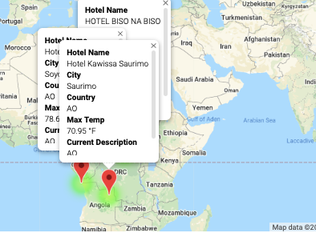

# World_Weather_Analysis

This project aims to answer questions such as: How to provide real-time suggestions for clients' ideal hotels?. The ideal hotels would meet the clients' weather criteria, specifically, the minimum and maximum temperature range that is given. Then, from the list of potential travel destinations, the client will choose four cities to create a travel itinerary. Finally, using the Google Maps Directions API, a travel route between the four cities and a marker layer map is created.

The main parts of the project consist of: 

1. Collection of the Data:

Use of the NumPy module to generate more than 2,000 random latitudes and longitudes.
Use of the citipy module to list the nearest city to the latitudes and longitudes.
Use of the OpenWeatherMap API to request the current weather data from each unique city on the list.
Parse the JSON data from the API request.
Collection of the following data from the JSON file and add it to a DataFrame:
City, country, Latitude and longitude, Maximum temperature, Humidity, Cloudiness, Wind speed & weather description. 

The results are shown in the image below (Fig. 1) 

##### Fig. 1 - Weather Database Dataframe

2. Use of input statements to retrieve customer weather preferences, then use those preferences to identify potential travel destinations and nearby hotels. The results are shown in Fig. 2 

##### Fig. 2 - Map of potencial hotels that meet weather preferences

3. Use of the Google Directions API to create a travel itinerary that shows the route between four cities chosen from the customer’s possible travel destinations. Then, a marker layer map with a pop-up marker for each city on the itinerary. For results, see figures 3 & 4.

##### Fig. 3 - Travel itinerary that shows the route between four cities chosen

##### Fig. 4 - Layer map with a pop-up marker for each city on the itinerary
